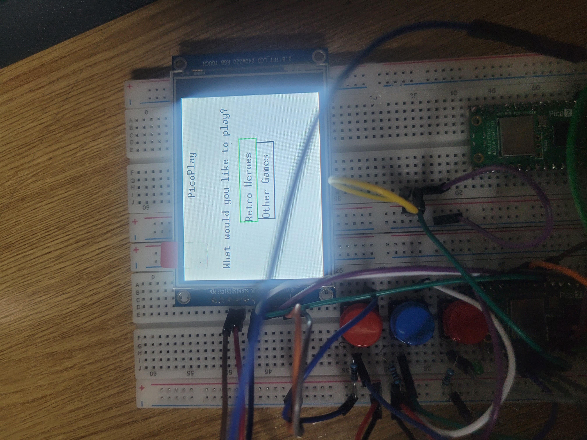
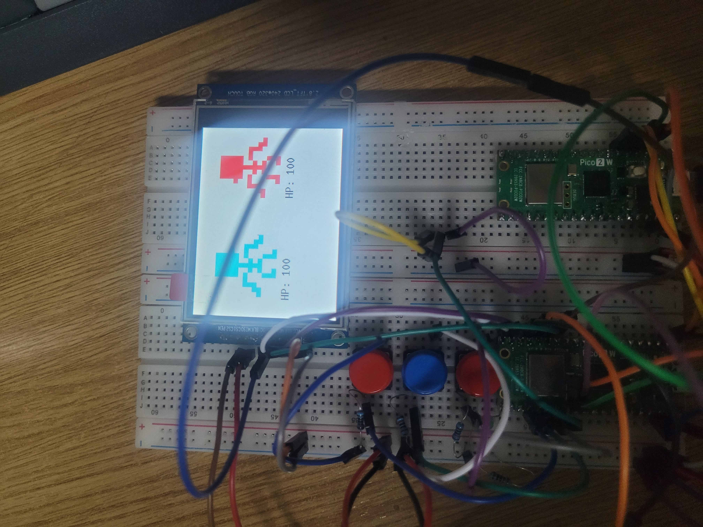

[](https://classroom.github.com/a/eG_xYHDU)

# PicoPlay

**PicoPlay** is a game console built from the ground up with multiplayer in mind.




# Installation
## Requirements

* `rust`
* `probe-rs`

## Steps

```git clone https://github.com/andrewstephengames/picoplay```
```cd picoplay```
```cargo build```
```cargo run```

# Project architecture

PicoPlay uses two Raspberry Pi Pico 2W microcontrollers, one for debugging, and the other for running code and managing peripherals. An ILI9341 LCD display is connected via SPI, which on boot presents the user with a menu of games that they may choose to play. Screen input is handled through three GPIO buttons; two are for navigating left and right and one is for selecting screen elements/actions. A buzzer is connected through PWM, in order to give feedback for each input.

The console also has networking functionality, and a green LED connected through GPIO indicates when the built-in network is succesfully reached.

# Hardware

* Raspberry Pi Pico 2W
* 2.8" SPI LCD Module with ILI9341 Controller (240x320 px)
* Passive buzzer
* 2x Red buttons with round covers
* Blue button with round cover
* Green LED
* Wires, resistors from a Plusivo kit